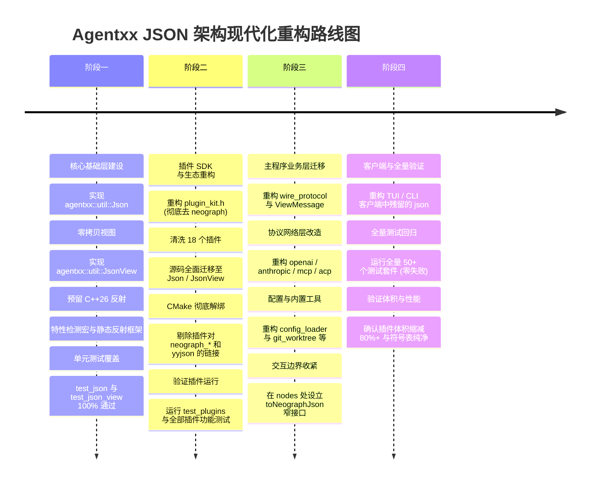

# Agentxx JSON 架构重构与现代化设计方案
### —— 基于 simdjson 构建自主 Json / JsonView、彻底解耦插件生态并隔离 NeoGraph 交互边界

---

## 1. 概述与重构背景

Agentxx 是基于 **C++23（编译器启用 C++26 / C17 标准）** 构建的生产级 AI Agent 框架。在现有的架构实现中，JSON 数据处理广泛依赖 `neograph::json`（NeoGraph 图引擎内部基于 C 库 `yyjson` 封装的类 nlohmann 风格 RAII 包装器）。随着系统演进，该依赖在插件解耦、架构分层、运行时性能及代码清洁度方面引发了显著的系统性问题。

### 1.1 现状痛点全景分析

1. **插件生态严重受制于 NeoGraph 庞大依赖**：
   - 根据插件架构规范（`docs/zh-cn/plugins.md`），Agentxx 插件必须遵循**纯 C ABI v1** 规范，跨边界仅传递基本数据类型与序列化字符串，保持高度解耦与二进制兼容。
   - 但在 C++ 开发辅助层，插件 SDK 头文件 `plugin_kit.h` 强引用了 `<neograph/json.h>`，导致每一个外置插件（包括仅做算术求值的 `agentxx_math`、文件操作的 `agentxx_filesystem` 等）在独立动态库构建时，均被迫链接全套 NeoGraph 动态/静态库及 `yyjson`：
     ```cmake
     # 当前全部插件 CMakeLists.txt 中充斥的冗余链接：
     neograph_sqlite, neograph_acp, neograph_mcp, neograph_mcp_types,
     neograph_async, neograph_llm, neograph_core, yyjson
     ```
   - 这导致各插件动态库体积虚高（由原本十几 KB 膨胀至数 MB）、链接时符号表严重污染，且一旦 NeoGraph 升级，所有外部插件都可能面临隐形 ABI 断裂风险。
2. **主程序通用模块与图引擎深层耦合**：
   - WebSocket 线协议（`wire_protocol.h`）、会话展示数据（`conversation_types.h` / `ViewMessage`）、LLM 提供者请求构造与流式解析（`openai_provider.cpp` / `anthropic_provider.cpp`）、配置管理（`config_loader.cpp`）以及本地工具集（`git_worktree`、`share_store` 等），其本质均属于通用的数据交换或网络通信逻辑，与 NeoGraph 图执行引擎并无直接从属关系，却因直接依赖 `neograph::json` 而导致架构层级颠倒、难以独立测试与复用。
3. **高频解析场景的堆分配开销（缺乏零拷贝视图）**：
   - 在 LLM SSE 流式输出（每个 Token 一个 chunk）、高频日志采集、WebSocket 消息路由与分发中，往往只需只读检查特定字段（如 `"type"`、`"id"` 等）。
   - 当前无论何种场景均必须构造完整的 `neograph::json` DOM 树，伴随大量的节点堆内存分配与字符串深拷贝，无法发挥现代 SIMD 硬件级解析的高吞吐潜能。
4. **既有 API 的现代 C++ 支持不足**：
   - 现有的 `neograph::json` 缺乏对 `std::string_view` 查找键的原生重载（源码中频繁出现 `argString(const neograph::json& args, const std::string& key)`，因无法直接使用 `string_view` 查找而产生冗余临时 `std::string` 构造）；
   - 无法直接利用现代编译器对 C++26 静态反射（P2996）的前瞻支持，结构体序列化与反序列化仍需手写样板代码。

### 1.2 核心重构目标与原则

| 维度 | 重构前现状 | 重构后目标 |
| :--- | :--- | :--- |
| **基础 JSON 设施** | 依赖 NeoGraph 内部的 `neograph::json` (yyjson) | 由 `agentxx_util` 提供自主研发的 `agentxx::util::Json` 与 `JsonView` |
| **底层性能驱动** | yyjson (纯 C 遍历构造) | `simdjson`（AVX2/AVX-512/NEON 向量化极速解析 + 紧凑缓冲构建） |
| **只读零拷贝支持** | 无（必须深拷贝反序列化为 DOM） | 提供 `agentxx::util::JsonView`，从 `string_view` 零分配直接只读解析 |
| **C++26 反射前瞻** | 无支持 | 预留 P2996 静态反射支持（零样板 struct ↔ JSON 自动转换） |
| **插件生态依赖** | 强绑定 `neograph_*` 动态/静态库 + `yyjson` | **彻底剔除 NeoGraph 依赖**，插件仅需纯 C ABI + `agentxx_util` |
| **NeoGraph 作用域** | 弥散在主程序、客户端、插件全代码库 | **严格收敛于图引擎最窄边界**（仅限于 `StateGraph` channels 及消息 extra 字段） |

---

## 2. 总体架构拓扑与交互边界划分

重构后的系统边界遵循**“核心业务纯净化、插件生态轻量化、图交互窄口化”**的三层架构：

```
+---------------------------------------------------------------------------------------+
|                                     客户端层 (Client)                                   |
|   TUI (FTXUI) / CLI (Stdio) / Overlays / MessageList                                  |
|   -> 统一采用 agentxx::util::Json & JsonView 处理用户交互与界面状态                      |
+-------------------------------------------|-------------------------------------------+
                                            | WireMessage (WS / In-Process Channel)
                                            | [JSON 序列化传输 (零拷贝解析)]
+-------------------------------------------v-------------------------------------------+
|                                  服务端层 (Server / Lib)                               |
|  +---------------------------------------------------------------------------------+  |
|  |                            通用业务与网络协议层                                   |  |
|  |  - 线协议编解码 (WireProtocol)         - 会话展示模型 (ViewMessage / ChainHash)    |  |
|  |  - 模型接入层 (OpenAI / Anthropic)     - 外部协议服务 (MCP / ACP / A2A)            |  |
|  |  - 配置加载 (ConfigLoader)             - 内置工具集 (GitWorktree / ShareStore 等)  |  |
|  |  ==> 全部使用 agentxx::util::Json & JsonView                                     |  |
|  +----------------------------------------|----------------------------------------+  |
|                                           |                                           |
|                                           | 【唯一转换边界 (Bridge)】                  |
|                                           v                                           |
|  +---------------------------------------------------------------------------------+  |
|  |                             NeoGraph 图执行引擎交互边界                           |  |
|  |  - GraphState Channel 写入 ("messages")                                         |  |
|  |  - ChatMessage::extra 存取                                                      |  |
|  |  - ChatTool::parameters 定义注入                                                 |  |
|  |  ==> 仅在此处调用 toNeographJson() / fromNeographJson() 转换为 neograph::json    |  |
|  +---------------------------------------------------------------------------------+  |
+-------------------------------------------|-------------------------------------------+
                                            | C ABI (AgentxxPluginToolSpec / OpDriver)
                                            | [传递 args_json / parameters_json 字符串]
+-------------------------------------------v-------------------------------------------+
|                                   插件体系 (Plugins)                                   |
|  Plugin Kit (C++ SDK) + 18 个外置/内置插件 (Filesystem / Command / Math / WebSearch 等) |
|  - 彻底移除 <neograph/json.h> 与所有 neograph_* 链接库                                  |
|  - 插件仅链接 agentxx_util，全面使用 agentxx::util::Json 与 JsonView                     |
+---------------------------------------------------------------------------------------+
```

---

## 3. 核心构件一：`agentxx::util::Json` 设计规范

`agentxx::util::Json` 位于 `agentxx_util` 静态库中，头文件为 `agentxx/util/json.h`，实现为 `agentxx/src/util/json.cpp`。

### 3.1 内部数据模型与内存布局
为确保对 LLM Prompt 构建、JSON Schema 定义、以及会话指纹哈希（`ChainHash`）的确定性支持，`Object` 内部采用**保序紧凑存储**；同时各基础数据类型采用显式定长布局：

```cpp
namespace agentxx::util {

class Json {
public:
    enum class Type : uint8_t {
        Null = 0,
        Boolean,
        NumberInt,      // int64_t
        NumberUint,     // uint64_t
        NumberFloat,    // double
        String,         // std::string
        Array,          // std::vector<Json>
        Object          // 保序键值对集合: std::vector<std::pair<std::string, Json>>
    };

    using array_t  = std::vector<Json>;
    using object_t = std::vector<std::pair<std::string, Json>>;

private:
    Type type_ = Type::Null;
    union {
        bool        bool_val_;
        int64_t     int_val_;
        uint64_t    uint_val_;
        double      float_val_;
        std::string str_val_;
        array_t     arr_val_;
        object_t    obj_val_;
    };
...
```

### 3.2 基于 simdjson 的极速解析机制 (`Json::parse`)
- 底层采用 `simdjson::dom::parser`。对于传入的 `std::string_view`，利用 `simdjson::padded_string` 或内置尾部缓冲保证 SIMD 向量对齐安全（满足 `simdjson::SIMDJSON_PADDING` 要求）。
- 解析阶段完成 UTF-8 合规性验证与语法解析；在构建 `Json` 树时，利用递归分发快速映射为 `Json` 节点。
- 当遇到语法畸形时，抛出规范的 `Json::parse_error`（派生自 `std::runtime_error`），提供精确的字节偏移量与错误描述。

### 3.3 高效序列化机制 (`dump`)
- **紧凑模式 (`indent = -1`，默认)**：
  - 基于单次连续内存分配的 `std::string`，借助 SIMD 快速转义表（转义 `"`、`\` 及控制字符）进行批量拼接，避免频繁 realloc。
- **格式化排版模式 (`indent >= 0`)**：
  - 支持指定缩进空格数量（如 2 或 4 个空格），优雅生成带换行和缩进的友好格式。
- **流输出支持**：
  - 重载 `friend std::ostream& operator<<(std::ostream& os, const Json& j)`。

### 3.4 API 接口设计与规范

```cpp
namespace agentxx::util {

class Json {
public:
    // ----- 异常体系 -----
    class exception : public std::runtime_error { using std::runtime_error::runtime_error; };
    class parse_error : public exception { using exception::exception; };
    class type_error  : public exception { using exception::exception; };
    class out_of_range: public exception { using exception::exception; };

    // ----- 工厂方法 -----
    static Json object();
    static Json object(std::initializer_list<std::pair<std::string_view, Json>> il);
    static Json array();
    static Json array(std::initializer_list<Json> il);
    static Json parse(std::string_view sv);
    static Json parse(std::istream& is);

    // ----- 构造函数 (完美覆盖基础标量与初始化列表) -----
    Json() noexcept : type_(Type::Null) {}
    Json(std::nullptr_t) noexcept : type_(Type::Null) {}
    Json(bool b) noexcept;
    Json(int i) noexcept;
    Json(unsigned int u) noexcept;
    Json(long l) noexcept;
    Json(unsigned long ul) noexcept;
    Json(long long ll) noexcept;
    Json(unsigned long long ull) noexcept;
    Json(double d) noexcept;
    Json(float f) noexcept;
    Json(const char* s);
    Json(std::string_view sv);
    Json(std::string s) noexcept;
    Json(const std::vector<std::string>& vec);

    // 智能初始化列表构造 (自动识别 {{"key", val}} 为 Object，其余为 Array)
    Json(std::initializer_list<Json> il);

    // 拷贝与移动
    Json(const Json& other);
    Json(Json&& other) noexcept;
    Json& operator=(const Json& other);
    Json& operator=(Json&& other) noexcept;
    ~Json();

    // ----- 类型检测 -----
    bool is_null() const noexcept;
    bool is_bool() const noexcept;
    bool is_boolean() const noexcept { return is_bool(); }
    bool is_number() const noexcept;
    bool is_number_integer() const noexcept;
    bool is_number_unsigned() const noexcept;
    bool is_number_float() const noexcept;
    bool is_string() const noexcept;
    bool is_array() const noexcept;
    bool is_object() const noexcept;
    bool is_primitive() const noexcept;
    Type type() const noexcept { return type_; }

    // ----- 容器查询与操作 -----
    size_t size() const noexcept;
    bool empty() const noexcept;
    void clear() noexcept;
    void push_back(const Json& val);
    void push_back(Json&& val);
    bool erase(std::string_view key);
    bool erase(size_t index);

    // ----- 原生 string_view 支持的键访问 -----
    Json& operator[](std::string_view key);          // 可写访问，若不存在则自动插入 Null 节点
    const Json& operator[](std::string_view key) const noexcept; // 只读访问，缺失时返回静态全局 Null 常量
    Json& operator[](size_t index);
    const Json& operator[](size_t index) const;
    Json& at(std::string_view key);                 // 强边界检查，缺失抛出 out_of_range
    const Json& at(std::string_view key) const;
    Json& at(size_t index);
    const Json& at(size_t index) const;
    bool contains(std::string_view key) const noexcept;

    // ----- 类型安全提取与默认值降级 -----
    template <typename T>
    T get() const;

    template <typename T>
    T value(std::string_view key, const T& default_value) const;
    std::string value(std::string_view key, const char* default_value) const;

    // ----- 迭代支持与结构化绑定 (items) -----
    struct ItemProxy {
        std::string_view key;
        Json&            value;
        // C++17 结构化绑定支持
        template <size_t I> auto& get() {
            if constexpr (I == 0) return key;
            else if constexpr (I == 1) return value;
        }
    };
    struct ConstItemProxy {
        std::string_view key;
        const Json&      value;
        template <size_t I> const auto& get() const {
            if constexpr (I == 0) return key;
            else if constexpr (I == 1) return value;
        }
    };

    class ItemsIterable;
    class ConstItemsIterable;
    ItemsIterable items();
    ConstItemsIterable items() const;

    // ----- 序列化 -----
    std::string dump(int indent = -1) const;

    // ----- 比较运算符 -----
    bool operator==(const Json& o) const noexcept;
    bool operator!=(const Json& o) const noexcept { return !(*this == o); }
};

} // namespace agentxx::util
```

---

## 4. 核心构件二：零拷贝只读视图 `agentxx::util::JsonView`

在很多高性能网络与事件通道中（例如 SSE Stream 流式 chunk 解析、日志过滤、权限校验、参数只读查询），创建可变 DOM 树会导致昂贵的内存分配与释放开销。为此专门设计 **`agentxx::util::JsonView`**。

### 4.1 核心设计机制
1. **零堆内存分配（Zero Allocation）**：
   - 内部仅持有 `simdjson::dom::element`。
   - 所有字符串获取（`get_string_view()`）直接借用输入缓冲区的内存切片，杜绝 `std::string` 堆拷贝。
2. **复用解析引擎（Parser Reuse）**：
   - 支持传入长生命周期的 `simdjson::dom::parser`，利用其内部已扩容的 tape 缓冲区，实现纳秒级解析。
3. **按需物化（Materialization on Demand）**：
   - 当调用方在只读检查通过后，需要进一步持久化或修改时，可通过 `.to_json()` 一键转换为可变 `agentxx::util::Json` 对象。

### 4.2 `JsonView` 接口规约

```cpp
namespace agentxx::util {

class JsonView {
public:
    JsonView() noexcept = default;
    JsonView(simdjson::dom::element elem) noexcept : elem_(elem) {}

    /// 一次性只读解析 (使用 thread_local parser 复用 buffer)
    static JsonView parse(std::string_view json_sv);

    /// 高性能批处理解析 (显式借用外部复用的 parser)
    static JsonView parse(std::string_view json_sv, simdjson::dom::parser& parser);

    // 类型探测
    bool is_null() const noexcept;
    bool is_bool() const noexcept;
    bool is_int64() const noexcept;
    bool is_uint64() const noexcept;
    bool is_double() const noexcept;
    bool is_string() const noexcept;
    bool is_array() const noexcept;
    bool is_object() const noexcept;

    // 零拷贝提取
    std::string_view get_string_view() const;
    bool             get_bool() const;
    int64_t          get_int64() const;
    uint64_t         get_uint64() const;
    double           get_double() const;

    // 只读导航
    JsonView operator[](std::string_view key) const noexcept;
    JsonView operator[](size_t index) const noexcept;
    bool contains(std::string_view key) const noexcept;
    size_t size() const noexcept;

    // 安全提取
    template <typename T>
    T value(std::string_view key, const T& def) const noexcept;

    // 按需实例化为可修改的 Json
    Json to_json() const;

private:
    simdjson::dom::element elem_{};
};

} // namespace agentxx::util
```

### 4.3 典型应用范例：SSE Stream 高频 Chunk 零拷贝分发
```cpp
// 以前: 每次进入 chunk 都要构造完整的 neograph::json，堆分配数十次
// 现在: 基于 JsonView，全程无堆分配，解析耗时下降一个数量级
void onSseChunkReceived(std::string_view chunkLine) {
    auto view = JsonView::parse(chunkLine);
    if (!view.is_object()) return;

    auto type = view["type"].value<std::string_view>("");
    if (type == "content_block_delta") {
        auto deltaText = view["delta"]["text"].get_string_view();
        emitTextToken(deltaText); // 零拷贝直接转发 string_view
    }
}
```

---

## 5. 核心构件三：预留 C++26 静态反射支持 (P2996)

当前项目编译器配置已开启 `c++26` 标准。simdjson 自身已在内部支持静态反射序列化（`SIMDJSON_STATIC_REFLECTION`）。本重构方案对 `agentxx::util::Json` 与 `JsonView` 作出前瞻性设计：

### 5.1 特性检测与反射开关
在 `agentxx/util/json.h` 中定义特性检测宏：
```cpp
#if defined(__cpp_impl_reflection) || defined(__cpp_static_reflection) || \
    (defined(__has_include) && __has_include(<meta>))
    #define AGENTXX_HAS_CPP26_REFLECTION 1
#else
    #define AGENTXX_HAS_CPP26_REFLECTION 0
#endif
```

### 5.2 零样板无侵入式自动反射设计

当编译器开启 C++26 静态反射时，任意 C++ 聚合结构体（Struct）均无需编写宏或 `to_json` / `from_json` 成员函数，直接享受自动序列化与反序列化：

```cpp
namespace agentxx::util {

#if AGENTXX_HAS_CPP26_REFLECTION

// 从任意结构体自动生成 Json (静态反射)
template <typename T>
    requires (std::is_class_v<T> && !std::is_same_v<T, Json> && !std::is_same_v<T, std::string>)
Json reflectToJson(const T& obj) {
    Json j = Json::object();
    template for (constexpr auto dm : std::define_static_array(
        std::meta::nonstatic_data_members_of(^^T, std::meta::access_context::unchecked()))) {
        constexpr auto memberName = std::meta::identifier_of(dm);
        j[memberName] = reflectToJson(obj.[:dm:]);
    }
    return j;
}

// 从 Json / JsonView 自动反序列化到结构体 (静态反射)
template <typename T>
    requires (std::is_class_v<T> && !std::is_same_v<T, Json>)
T reflectFromJson(const Json& j) {
    T obj{};
    template for (constexpr auto dm : std::define_static_array(
        std::meta::nonstatic_data_members_of(^^T, std::meta::access_context::unchecked()))) {
        constexpr auto memberName = std::meta::identifier_of(dm);
        if (j.contains(memberName)) {
            using MemberType = typename[:std::meta::type_of(dm):];
            obj.[:dm:] = j[memberName].get<MemberType>();
        }
    }
    return obj;
}

#else

// 在未完全支持反射的编译环境下，提供优雅的概念约束降级 (Concepts / ADL)
template <typename T>
Json reflectToJson(const T& obj) {
    return toJson(obj); // 回退到普通 ADL toJson
}

template <typename T>
T reflectFromJson(const Json& j) {
    T obj{};
    fromJson(j, obj);
    return obj;
}

#endif

} // namespace agentxx::util
```

---

## 6. 插件体系重构规范（彻底去 NeoGraph）

### 6.1 `plugin_kit.h` SDK 升级
1. **彻底移除 `<neograph/json.h>`**：
   - 替换为 `#include "agentxx/util/json.h"` 及 `#include "agentxx/util/json_view.h"`。
   - 定义插件作用域别名：`using Json = agentxx::util::Json;` 与 `using JsonView = agentxx::util::JsonView;`。
2. **`ToolSchema` 重构**：
   - 内部存储全部改为 `agentxx::util::Json`：
     ```cpp
     class ToolSchema {
     public:
         ToolSchema& property(std::string_view name, std::string_view type, std::string_view desc, bool required = false);
         std::string str() const { return schema_.dump(); }
         const agentxx::util::Json& json() const { return schema_; }
     private:
         agentxx::util::Json schema_ = agentxx::util::Json::object();
     };
     ```
3. **`ArgReader` 强化**：
   - 底层由 `agentxx::util::Json`（及 `JsonView`）驱动，避免原本基于异常捕获的低效类型转换，全面提供 `arg.get<T>("name")`、`arg.has("name")`。
4. **UI Action 系统解耦**：
   - `using Handler = std::function<void(const agentxx::util::Json& args)>;`
   - `makeButton` 等组件构造器产出 `agentxx::util::Json`。

### 6.2 现有 18 个插件目标的代码改造清单

| 插件名称 | 涉及源码文件 | 改造关键点 |
| :--- | :--- | :--- |
| **`agentxx_filesystem`** | `filesystem_impl.h`<br>`agentxx_fs_plugin.h`<br>`agentxx_filesystem.cpp` | `arguments` 参数类型转为 `const agentxx::util::Json&`；移除所有 `neograph::json`。 |
| **`agentxx_execute_command`**| `execute_command_impl.h`<br>`agentxx_execmd_plugin.h` | 移除 `neograph::json`；命令执行参数提取与结果封装改用 `agentxx::util::Json`。 |
| **`agentxx_math`** | `math_impl.h`<br>`agentxx_math_plugin.h`<br>`agentxx_math.cpp` | 运算参数解析改用 `agentxx::util::Json`。 |
| **`agentxx_string`** | `string_impl.h`<br>`agentxx_string_plugin.h` | 正则匹配与 html2md 参数及返回值改用 `agentxx::util::Json`。 |
| **`agentxx_system`** | `agentxx_system_plugin.h`<br>`agentxx_system.cpp` | 系统时间与日期构造改用 `agentxx::util::Json`。 |
| **`agentxx_websearch`** | `websearch_impl.h`<br>`agentxx_websearch_plugin.h` | 请求头与搜索参数改用 `agentxx::util::Json`。 |
| **`agentxx_planning`** | `agentxx_planning.cpp`<br>`agentxx_planning_plugin.h` | 彻底移除 `neograph::json`，规划树与 Todos 改用 `agentxx::util::Json` 解析与序列化。 |
| **`agentxx_rag_search`** | `rag_search_impl.h`<br>`rag_plugin.h` | 文档向量化请求与检索结果解析转为 `agentxx::util::Json`。 |
| **`agentxx_codegraph`** | `codegraph_plugin.h`<br>`agentxx_codegraph.cpp` | **删除内部自行手写的 `SimpleJson` 桩**，统一换成 `agentxx::util::Json` 与 `JsonView`。 |
| **`agentxx_computer_use`** | `computer_use_plugin.h`<br>`ui_control.cpp` | 消除原本混杂的 `simdjson` 局部解析与 `neograph::json`，统一采用新体系。 |
| **`agentxx_screen_capture`** | `screen_capture_plugin.h`<br>`agentxx_screen_capture.cpp` | 图像元数据帧格式化改用 `agentxx::util::Json`。 |
| **`agentxx_system_monitor`** | `system_monitor_plugin.h`<br>`agentxx_system_monitor.cpp`| CPU/GPU 监控数据上报转为 `agentxx::util::Json`。 |
| **`agentxx_text_selection`** | `text_selection_monitor.cpp` | 消除局部临时解析代码，统一适配。 |
| **`agentxx_audio_stream`** | `audio_stream_plugin.h` | 消除硬编码的局部 parser，接入 `agentxx::util::Json`。 |
| **`agentxx_javascript_engine`**<br>**`agentxx_execute_javascript`** | 对应插件实现源文件 | JS 与 C++ 交换数据统一由 `agentxx::util::Json` 桥接。 |
| **`example_plugin`**<br>**`example_graph_node`** | 示例插件源码 | 替换为现代 `agentxx::util::Json` 范例。 |

### 6.3 插件 CMake 构建体系的大清洗
在所有插件的 `CMakeLists.txt` 中，彻底删除以下依赖：
```cmake
# ----------------------------------------------------
# 彻底删除以下代码块 (不再需要任何 neograph 库和 yyjson):
# ----------------------------------------------------
# target_link_libraries(${PLUGIN_NAME} PRIVATE
#   neograph_sqlite
#   neograph_acp
#   neograph_mcp
#   neograph_mcp_types
#   neograph_async
#   neograph_llm
#   neograph_core
#   yyjson
# )
# ----------------------------------------------------

# 重构后各插件的标准简洁配置:
target_link_libraries(${PLUGIN_NAME} PRIVATE
  agentxx_util
)
```
- **体积瘦身预期**：各独立插件动态库（.so/.dll）体积预计缩减 **80% ~ 90%**，去除了全部与图引擎相关的虚表、静态对象和冗余代码段。

---

## 7. 主程序业务层全面重构方案

### 7.1 线协议体系 (`wire_protocol.h` / `cpp`)
- 将所有协议打包函数：
  - `deltaToJson`, `deltaFromJson`
  - `syncToJson`, `syncFromJson`
  - `messageQueueItemToJson`, `messageQueueItemFromJson`
  - `makeHello`, `makeHelloAck`, `makeUserInput`, `makeTurnResult`, `makeInterruptRequest` 等
- 全部签名中的 `neograph::json` 替换为 `agentxx::util::Json`。
- 在 `ws_io_transport.cpp` 或协议接收端，优先使用 `JsonView` 提取消息类型并路由，命中后再进行结构反序列化。

### 7.2 会话展示模型 (`conversation_types.h` / `ViewMessage`)
- `ViewMessage::toJson()` 与 `ViewMessage::fromJson()` 签名与实现全面改为使用 `agentxx::util::Json`。
- 链式哈希计算 `ChainHash::append(std::string_view serialized)`：
  - 因为 `agentxx::util::Json::dump()` 拥有严格保序的 Object 序列化特性，计算出的哈希指纹具有 100% 确定性。

### 7.3 LLM 提供者网络接入 (`openai_provider` / `anthropic_provider`)
- 请求构造：`buildBody` 与 `buildResponsesBody` 内部全部使用 `agentxx::util::Json` 组装。
- SSE 流式解析：每次收到 chunk 时，利用 `JsonView::parse` 零拷贝读取 `delta.text`、`delta.thinking`，解析速度达到数倍提升。
- Token 统计提取：`parseUsage` 使用 `JsonView` 或 `Json` 的类型安全访问。

### 7.4 内置工具集与配置管理
- `git_worktree.cpp`、`share_store.cpp`、`subagent.cpp`、`tool.cpp`：
  - 工具逻辑参数全面使用 `agentxx::util::Json`，支持 `string_view` 零拷贝查询。
- `config.h` 中的 `ModelConfig::extraConfig` 字段类型由 `neograph::json` 替换为 `agentxx::util::Json`。
- `config_loader.cpp` 中的 `yamlToJson` 直接构造产出 `agentxx::util::Json`。

---

## 8. NeoGraph 交互边界的收敛与隔离 (Bridge)

### 8.1 唯一合法的保留交互点
根据整体架构设计，`neograph::json` 在整个项目中**仅在以下 3 处与 NeoGraph 核心引擎直接接触的狭窄边界保留**：
1. **`StateGraph` 通道读写**：
   - 向图引擎写入消息时（如 `in.state.write("messages", neograph::json::array({...}))`）。
2. **`neograph::ChatMessage` 结构体成员**：
   - `neograph::ChatMessage::extra`（底层定义为 `neograph::json`）。
3. **`neograph::ChatTool` 结构体成员**：
   - `neograph::ChatTool::parameters`（LLM 工具描述 Schema，定义为 `neograph::json`）。

### 8.2 专用桥接器：`agentxx/util/neograph_json_bridge.h`
通过专门的内联桥接头文件处理两者的转换，该头文件只允许在 `agent/lib/src/nodes/` 及 `BaseAgent` 内部包含，严禁泄漏到业务层、工具层或插件层：

```cpp
#pragma once

#include "agentxx/util/json.h"
#include <neograph/json.h>

namespace agentxx::util {

/// agentxx::util::Json -> neograph::json (进入 NeoGraph 图边界时使用)
inline neograph::json toNeographJson(const Json& j) {
    // 基于内存极速序列化与转换
    switch (j.type()) {
        case Json::Type::Null:        return neograph::json{};
        case Json::Type::Boolean:     return neograph::json(j.get<bool>());
        case Json::Type::NumberInt:   return neograph::json(j.get<int64_t>());
        case Json::Type::NumberUint:  return neograph::json(j.get<uint64_t>());
        case Json::Type::NumberFloat: return neograph::json(j.get<double>());
        case Json::Type::String:      return neograph::json(j.get<std::string>());
        case Json::Type::Array: {
            auto arr = neograph::json::array();
            for (size_t i = 0; i < j.size(); ++i) {
                arr.push_back(toNeographJson(j[i]));
            }
            return arr;
        }
        case Json::Type::Object: {
            auto obj = neograph::json::object();
            for (const auto& [k, v] : j.items()) {
                obj[std::string(k)] = toNeographJson(v);
            }
            return obj;
        }
    }
    return neograph::json{};
}

/// neograph::json -> agentxx::util::Json (从 NeoGraph 图边界退出时使用)
inline Json fromNeographJson(const neograph::json& j) {
    if (j.is_null()) return Json{};
    if (j.is_boolean()) return Json(j.get<bool>());
    if (j.is_number_integer()) return Json(j.get<int64_t>());
    if (j.is_number_unsigned()) return Json(j.get<uint64_t>());
    if (j.is_number_float()) return Json(j.get<double>());
    if (j.is_string()) return Json(j.get<std::string>());
    if (j.is_array()) {
        auto arr = Json::array();
        for (const auto& item : j) {
            arr.push_back(fromNeographJson(item));
        }
        return arr;
    }
    if (j.is_object()) {
        auto obj = Json::object();
        for (const auto& [k, v] : j.items()) {
            obj[k] = fromNeographJson(v);
        }
        return obj;
    }
    return Json{};
}

} // namespace agentxx::util
```

---

## 9. 测试、验证与质量保证方案

为保证庞大系统的平稳升级，重构必须具备完整的质量闭环：

### 9.1 新建核心单元测试
- **`agent/test/core/test_json.cpp`**：
  - 构造与初始化列表测试（含标量、数组、嵌套保序对象）；
  - `simdjson` 底层驱动的超长 JSON、畸形 JSON、转义特殊字符的解析与异常验证；
  - `operator[]`、`at()`、`value()` 默认值提取及字符串转数字宽容性测试；
  - 迭代器与 C++17 结构化绑定（`for (const auto& [k, v] : j.items())`）测试；
  - 紧凑与格式化 `dump()` 一致性校验。
- **`agent/test/core/test_json_view.cpp`**：
  - 针对 `std::string_view` 的零堆分配解析测试；
  - 字段只读提取准确性；
  - `.to_json()` 物化为可变树的正确性测试。
- **`agent/test/core/test_json_reflection.cpp`**：
  - C++26 静态反射自动序列化与反序列化测试（若当前编译器支持则启用）。

### 9.2 既有测试套件回归验证
运行现有的全部 50+ 个测试模块：
```bash
./agentxx_test --fail-fast
```
重点验证涉及 JSON 重构的模块：
- `toolcall_args`（参数解析与自动类型修复）
- `config_loader`（YAML 转 JSON 配置解析）
- `openai_provider` / `anthropic_provider`（LLM 请求构建与响应解析）
- `wire_protocol` / `event_bridge`（协议与消息同步）
- `plugins` / `client_plugins` / `plugin_multi_instance`（插件加载与工具调度）
- `filesystem` / `command` / `math_tools` / `string_tools` / `web_search` / `codegraph`（各插件工具功能）

### 9.3 性能基准与体积对比指标
1. **插件动态库体积**：对比重构前后各插件动态库的 `.so` / `.dll` 物理大小，验证剥离 NeoGraph 后的瘦身效果。
2. **动态符号表纯净化**：执行 `nm -D libagentxx_math.so`，确认除入口符号外无外部库符号泄漏。
3. **解析吞吐提升**：对比基于 `JsonView` 的高频解析与原 `neograph::json` 的解析延时与吞吐量。

---

## 10. 分阶段落地实施路线图



---

*本方案全面梳理了 Agentxx 框架的 JSON 重构需求，既解决了插件生态与 NeoGraph 的深层耦合历史包袱，又引入了基于 simdjson 的零拷贝与 C++26 静态反射前瞻能力，为框架的长期演进奠定了坚实的基础。*
