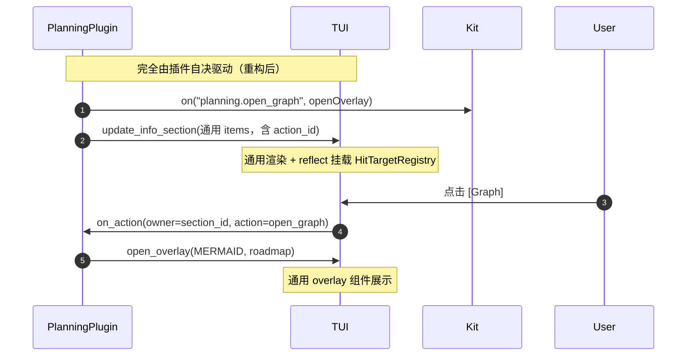

# 插件 Client 端事件处理与声明式交互重构方案

> 目标: 彻底消除 TUI 核心层对特定插件 (Planning 等) 的特化分支与硬编码交互，
> 建立由插件声明 UI、驱动事件回调、绑定函数执行的通用 Client 端交互架构。
>
> 已确认决策:
> - 术语统一为 `overlay`（不再用 `modal`），与 TUI 现有 `ModalContainer` /
>   `MermaidDiagramOverlay` / `FailedComponentsOverlay` 对齐。
> - 路由采用 **方案 A：实例级 fallback**（`bind("", dispatch)` 兜底 +
>   decor 以 `toolCallId` 作 `owner_id`），不采用纯 per-target。
> - `failedViewButtonBox_` / `openFailedAppendComponents` 是核心 Append 失败 UI，
>   **保留**，不进通用拾取。同样保留 `pendingInsert/Counter`、`contextButton`、
>   `retryButtonBox`、状态栏盒子等核心交互。
> - `open_overlay` 首版即实现 `MERMAID / TEXT / DIFF / CUSTOM` 四种类型。

---

## 1. 背景与核心诉求

### 1.1 现状与痛点（经代码勘误后的准确清单）

当前真正的插件特化只有一处（Planning），但散落在三地：

| 位置 | 现状 | 定性 |
| :--- | :--- | :--- |
| `agent_tui.h:555` `planGraphButtonBox_ / planGraphMermaid_` + `openMermaidDiagram(string)` | Info 栏写死 Plan Graph 弹窗 | 真特化，删除 |
| `tui_sidebar_content.cpp:appendPluginItems(mermaidButtonBox, mermaidSource)` + `renderInfoSidebar` 每帧清空/填充 | 偷看 `button.mermaid` 挂 `reflect` | 真特化，通用化 |
| `agent_tui.cpp:750` `planGraphButtonBox_.Contain` 分支 | 写死点击动作 | 真特化，接入通用派发 |
| `message_list.cpp:appendDecorItems` 的 `button` 分支 | 纯静态渲染，无 `reflect`、无点击 | 半特化：`mermaid / diagram` 语义是 planning 泄漏，需转 `action_id` |
| `message_list.cpp:appendDecorItems` 的 `diagram` 分支 | 内联展开整张状态大图 | 兼容保留渲染，但不再承担交互 |
| `agent_tui.cpp:renderPluginPanel` 的 `kind=="action"` 分支 | 渲染 `◈ label` 纯文本，无回调 | 遗留死 schema，统一到 `button + action_id` |
| 三处渲染 helper（sidebar / panel / message）各写一份 button 解析 | 样式与拾取逻辑三份拷贝 | 收敛到同一共享 helper，否则下次还漂移 |

非特化、必须保留的核心 UI：

- `failedViewButtonBox_` + `openFailedAppendComponents`（Append 失败组）。
- `pendingInsertButtonBox_ / pendingCounterBox_`（待发送队列）。
- `contextButtonBox_`（Logs Menu）、`retryButtonBox_`（连接失败 banner）、
  状态栏 `modelBox / sessionBox / settingsBox`。
- `MermaidDiagramOverlay` 本体是通用组件，只是当前只有 planning 在用；
  保留并改为通用 `open_overlay` 驱动（支持自定义标题）。

### 1.2 核心诉求

1. **宿主彻底通用化 (Zero Specialization)**：TUI 退化为“渲染引擎 + 几何拾取
   + 线程派发”，不含任何插件名、业务意图。
2. **真正的插件交互闭环**：插件声明按钮的同时绑定到实例自身函数；回调中可
   调后端能力、代发消息、更新 UI、请求宿主 overlay 能力。
3. **C ABI 安全 + 现代 C++ 体验**：跨 `.so/.dll` 只走 C 数据与 C 函数指针；
   插件侧以 Lambda 风格编写逻辑（`ActionController`）。

---

## 2. 约束分析

### 2.1 C ABI 边界与多实例三铁律

- 跨边界仅传 C 基础类型、定长结构体、纯 C 函数指针；禁 `std::function`、
  C++ 类、虚表类型。
- 同一动态库可多实例并存；回调必须经 `user_data` 精确还原实例，禁全局 /
  函数级 static 缓存。
- 内存函数指针不可序列化为 JSON（ASLR、野指针、悬垂风险）；JSON 只传
  `action_id` 字符串，函数映射留在插件进程侧内存 `map<action_id, lambda>`。

### 2.2 FTXUI 与线程模型

- 无 DOM 持久节点；每帧 `reflect(box)` 拾取屏幕绝对坐标；缩放/滚动/伸缩
  导致坐标每帧变动 → 命中表必须**每帧重建**。
- 渲染在 UI 线程 `OnRender`；点击在 UI 线程 `OnEvent`；插件业务在
  **Client IO 线程**（与网络 IO、会话状态同线程，无锁安全）。
- 点击瞬间插件可能正推送新 JSON（旧按钮已删除）→ UI 线程只拷贝字符串快照，
  IO 线程二次校验绑定有效性，防 UAF。

---

## 3. 总体架构：Action-Driven（三层）+ 方案 A 路由

```
┌──────────────────────────────────────────────────────────────┐
│ 插件层 (Kit ActionController)                                 │
│ kit.on("planning.open_graph", [this](args){ openOverlay(); })│
└──────────────────────────────┬───────────────────────────────┘
                               │ 1. action_id -> lambda (实例内存)
                               │ 2. JSON 只带 action_id + args
                               ▼
┌──────────────────────────────────────────────────────────────┐
│ C ABI 边界                                                    │
│ JSON: {"kind":"button","action_id":"planning.open_graph",...}│
│ C 回调: on_action(const AgentxxUiActionContext*, ud)         │
│ 能力: bind_action_handler / open_overlay / close_overlay     │
└──────────────────────────────┬───────────────────────────────┘
                               ▼
┌──────────────────────────────────────────────────────────────┐
│ 宿主层 (Manager + TUI)                                        │
│ Render: 通用解析 button -> HitTargetRegistry (每帧重建)       │
│ Event : 几何命中 -> postToIo -> 校验 -> 插件回调 (IO 线程)     │
│ Overlay: 通用 open_overlay(spec) -> Overlay 组件              │
└──────────────────────────────────────────────────────────────┘
```

### 3.1 为什么是方案 A（实例级 fallback）

`bind` 按 `target_id`（段落/面板 ID）绑定，一个 `bind` 管该 target 下全部
按钮（靠 `action_id` 区分）。但消息装饰 `ClientToolDecor` 的 key 是动态
`tool_call_id`（每次工具调用 newborn），插件无法提前预知逐个 `bind`。

- **方案 A（采用）**：允许 `target_id == ""` 表示本实例兜底。派发时精确匹配
  优先，未命中回落到 `""`。decor 按钮以 `toolCallId` 作 `owner_id`，
  插件 `bind` 一次永久生效。
- **方案 B（否决）**：纯 per-target，每个 call 都 `bind/unbind`，引入
  “先渲染还是先绑定”时序竞争、绑定数随对话无限涨、切换会话清理复杂。

派发上下文统一为 `(plugin, owner_id, action_id, args)`：

- Info/Panel：`owner_id = section_id / panel_id`。
- Decor：`owner_id = tool_call_id`。
- CUSTOM overlay 内按钮：`plugin = opener`，`owner_id = "__overlay"`，
  同样被 fallback 接住（见 §7.4）。

---

## 4. ABI 规范（`client_plugin_api.h`，v2 → v3）

全局 `AGENTXX_CLIENT_PLUGIN_API_VERSION` 保持 1；`AgentxxClientUiIface`
独立演进至 3，**尾部追加**新成员，老插件/老宿主按版本截断视角兼容。

### 4.1 动作上下文与回调

```c
typedef struct AgentxxUiActionContext {
    int32_t                 version;     ///< == 1
    uint32_t                _reserved;
    AgentxxPluginStringView owner_id;    ///< section_id / panel_id / tool_call_id / "__overlay"
    AgentxxPluginStringView action_id;   ///< 按钮声明的 action_id
    AgentxxPluginStringView action_args; ///< JSON object dump（空 = 无参）
} AgentxxUiActionContext;

typedef void(AGENTXX_PLUGIN_CALL *AgentxxUiActionFn)(
    const AgentxxUiActionContext* ctx,
    void*                         user_data
);
```

### 4.2 Overlay 类型与参数（四种，首版全实现）

```c
typedef enum AgentxxOverlayType {
    AGENTXX_OVERLAY_MERMAID = 0, ///< 状态图：payload = mermaid 源码
    AGENTXX_OVERLAY_TEXT    = 1, ///< 文本/Markdown：payload = 原文
    AGENTXX_OVERLAY_DIFF    = 2, ///< 对比：payload = JSON {path,old_str,new_str}
    AGENTXX_OVERLAY_CUSTOM  = 3, ///< 自定义：payload = JSON {"items":[...]}
} AgentxxOverlayType;

typedef struct AgentxxOverlaySpec {
    int32_t                 version;    ///< == 1
    int32_t                 type;       ///< AgentxxOverlayType
    AgentxxPluginStringView title;      ///< 标题（空则宿主回退默认）
    AgentxxPluginStringView payload;    ///< 内容（语义见下表）
    AgentxxPluginStringView extra_json; ///< 扩展（JSON object，可空 "{}"）
} AgentxxOverlaySpec;
```

| type | payload | extra_json（可选） | TUI 复用件 |
| :--- | :--- | :--- | :--- |
| MERMAID | mermaid 源码（`stateDiagram-v2 ...`） | `{"width_frac":0.8}` | `MermaidDiagramOverlay`（构造改传 title） |
| TEXT | 原文 | `{"markdown":true/false}`（缺省 true 按 markdown 渲染，否则纯段落） | 新 `TextOverlay`（Scrollable + markdown/paragraph） |
| DIFF | `{"path":"...","old_str":"...","new_str":"..."}` | `{"side_by_side":true}`（缺省按宽度自适应 ≥100 列并排） | 新 `DiffOverlay`（复用 `computeLineDiff` + `renderEditToolDiff` 逻辑，需从 `message_list.cpp` 抽共享 helper） |
| CUSTOM | `{"items":[{kind:text/progress/badge/separator/button}...]}`（同 panel/items schema，button 同样走 `action_id`） | `{"width_frac":0.8}` | 新 `CustomOverlay`（Scrollable + 共享 button helper + overlay 局部命中） |

`open / close` 语义：

- 单模态 last-wins：`open_overlay` 替换当前 overlay（含核心弹窗），记录
  `overlayOwner = plugin`；`close_overlay` 关闭当前（任何插件都可关，
  manager 传 plugin 名仅记日志/鉴权预留）。
- 调用线程：插件 `on_action` 内（IO 线程）直接调；manager 拷贝字符串后
  `postToUi`，不阻塞插件。

### 4.3 `AgentxxClientUiIface` 新增成员（v3，尾部追加）

```c
typedef struct AgentxxClientUiIface {
    int32_t version; uint32_t _reserved;
    /* ... v2 既有成员保持顺序与偏移不变 ... */

    /* ---- 通用交互 (v3 新增) ---- */
    /// 绑定动作处理器。target_id 空串 = 本实例兜底（方案 A）。
    /// 同一 (plugin, target_id) 重复绑定覆盖；返回 0 成功。
    int32_t(AGENTXX_PLUGIN_CALL* bind_action_handler)(
        const AgentxxPluginHost*       host,
        const AgentxxPluginStringView* target_id,
        AgentxxUiActionFn              on_action,
        void*                          user_data);
    int32_t(AGENTXX_PLUGIN_CALL* unbind_action_handler)(
        const AgentxxPluginHost*       host,
        const AgentxxPluginStringView* target_id);
    /// 通用 overlay。spec->version 必须 == 1；返回 0 成功。
    int32_t(AGENTXX_PLUGIN_CALL* open_overlay)(
        const AgentxxPluginHost*  host,
        const AgentxxOverlaySpec* spec);
    void(AGENTXX_PLUGIN_CALL* close_overlay)(
        const AgentxxPluginHost* host);
} AgentxxClientUiIface;
```

### 4.4 接口协商（`plugin_common.h`）

新增能力名：

```c
ClientAction  = "agentxx.client.action";  // bind/unbind + button 拾取派发
ClientOverlay = "agentxx.client.overlay"; // open/close overlay
```

- `TuiPluginAdapter::supportedInterfaces()` 增加两者；`CliPluginAdapter`
  不声明（CLI 无按钮面/弹窗面）。
- `clientUiIface()` 表按适配器能力置 NULL：不支持时 `bind/open` 为 NULL，
  插件判空降级（planning 仍推送内容，只是按钮不可点）。
- `plugin.yaml` 以 `optional` 声明：
  `optional: [agentxx.client.info_section, agentxx.client.action, agentxx.client.overlay]`。

---

## 5. 声明式 JSON Schema

### 5.1 按钮（Info / Panel / Decor / CUSTOM overlay 通用）

```json
{
  "kind": "button",
  "label": "[Graph]",
  "prefix": "|- ",
  "action_id": "planning.open_graph",
  "args": {"view_mode": "full"},
  "role": "accent"
}
```

- `label` 必填（按钮文字；TUI 自动左右各补一空格，无需插件手写）。
- `prefix` 可选（同行前导，如 `"|- "`；等价于“前一项 text + 本按钮”的隐式
  合并，渲染器两者都支持，效果一致）。
- `action_id`：有则可点（且快照中有该 plugin 绑定才挂 `reflect`），无则纯静态。
- `args`：可选 object，点击时 `dump` 后透传 `action_args`（建议 ≤64KB，
  超限宿主截断记日志）。
- `role`：`normal`（默认按钮配色）/ `accent`（强调）/ `danger`（错误色，
  如删除/高危操作）。

### 5.2 兼容规则（首版双发，下版清理）

- `button.mermaid`（老 planning）：新 TUI **不再据此弹窗**，仅老宿主兼容；
  首版 planning 同时发 `action_id + mermaid`，下版删 `mermaid`。
- `button` 无 `action_id`：静态渲染（CLI/老链路行为）。
- Panel 旧 `{"kind":"action","id":...,"label":...}`：视为
  `action_id = id` 兼容渲染。
- `diagram` kind：保留静态内联渲染（历史消息兼容），不挂点击。

---

## 6. ClientPluginManager 设计

### 6.1 数据结构（`client_plugin_manager.h`）

```cpp
struct ClientActionBinding {
    std::string       targetId;  // "" = 实例级 fallback
    std::string       plugin;
    AgentxxUiActionFn cb = nullptr;
    void*             ud = nullptr;
};
// ClientUiRegistry 新增：
std::vector<ClientActionBinding> actionBindings; // COW 快照，UI 线程无锁读
// ClientPluginInstance 新增（disable 保留、unload 清理，与 xxxRegs 一致）：
std::vector<ClientActionBinding> actionRegs;
```

快照可见性是关键：绑定表必须进 `ClientUiRegistry`，否则 UI 线程渲染时
查不到“该按钮是否可点”。

### 6.2 写路径（IO 线程）

- `bindActionHandler(inst, targetId, cb, ud)`：`cb` 空则失败；同
  `(plugin, targetId)` 覆盖；同步写 `uiRegistry_`（COW）+ `inst->actionRegs`。
- `unbindActionHandler(inst, targetId)`：摘除（不存在忽略）。
- `registerPanel / registerInfoSection / updateToolDecor` 不变（内容与绑定
  正交，按钮可先渲染后绑定，渲染时按快照有无绑定决定是否可点）。
- `detachAll(inst, keepInfo)`：摘除该 plugin 的注册表条目 + adapter 信号；
  `keepInfo=true`（disable）保留 `actionRegs`，`false`（unload）彻底清。
  `enable` 按 `actionRegs` 重建快照（与 panel/info 恢复同 pattern）。
- `openOverlay(inst, spec)`：校验 `version/type`，拷贝
  `(title, payload, extra)` 为 `std::string` 后调
  `adapter->onOverlayOpen(plugin, type, title, payload, extra)`。
- `closeOverlay(inst)`：调 `adapter->onOverlayClose(plugin)`。

### 6.3 读/派发路径

```cpp
// UI 线程调（点击命中后），内部 postToIo：
void dispatchAction(std::string plugin, std::string ownerId,
                    std::string actionId, std::string argsJson);
```

IO 线程二次校验（缺一即丢弃记日志）：

1. `plugins_.find(plugin)` 存在且 `enabled`；
2. 精确 `bindings[ownerId]` 命中，否则回落 `bindings[""]`；
3. 快照中的 `cb/ud` 与实例当前一致（防“点击瞬间 unbind/unload” UAF）；
4. `InflightGuard` 后直调 `cb(&ctx, ud)`，异常兜底不打断循环。

`action_args` 传 `argsJson` 的 `dump`（无参传空视图，Kit 侧统一给 `{}`）。

### 6.4 vtable（`client_plugin_manager.cpp`）

新增 `xx_cbind_action_handler / xx_cunbind_action_handler / xx_copen_overlay /
xx_cclose_overlay`，全部包 `guardVtableCall` + `ioCallSync` 回 IO 线程，
与现有 `register/update` 件一致。`query_interface` 返回的 `clientUiIface()`
按 `hostSupportedInterfaces()` 置空不支持成员。

### 6.5 `PluginUiAdapter` 新增

```cpp
virtual void onOverlayOpen(const std::string& plugin, int type,
    const std::string& title, const std::string& payload,
    const std::string& extraJson) {}
virtual void onOverlayClose(const std::string& plugin) {}
```

TUI 实现 `postToUi` 投递；CLI 空实现（且能力未声明，manager 侧已拒）。

---

## 7. TUI 设计（零特化）

### 7.1 删除清单（彻底移除）

- `agent_tui.h`：`planGraphButtonBox_ / planGraphMermaid_` 成员、
  `openMermaidDiagram(const std::string&)` 声明。
- `tui_sidebar_content.cpp`：`appendPluginItems` 的 `mermaidButtonBox /
  mermaidSource` 参数、`renderInfoSidebar` 的逐帧清空填充、偷看 `mermaid`
  的两个分支。
- `agent_tui.cpp`：`planGraph` 点击分支；`renderPluginPanel` 的
  `kind=="action"` 静态分支（改走通用 button）。
- `message_list.cpp`：`button` 分支中“`mermaid` 即弹窗”的注释与逻辑
  （改走 `action_id`）。

保留：`failedView`、`pendingInsert/Counter`、`contextButton`、`retry`、
状态栏盒子及各自点击分支。

### 7.2 共享渲染 helper（新文件 `plugin_ui_items.h/.cpp`）

sidebar / panel / message 三处共用，杜绝三份拷贝漂移：

```cpp
struct PluginButtonDesc {
    std::string label, prefix, actionId, argsJson, role;
    bool clickable = false; // actionId 非空 && 快照有该 plugin 绑定
};
bool parsePluginButton(const neograph::json& it, PluginButtonDesc& out);
ftxui::Element renderPluginButton(const PluginButtonDesc&, const TUITheme&);
// role 配色：normal=buttonBg/Text；accent=buttonActiveBg/Text；danger=error 背景 + buttonText
```

`text + button` 隐式同行合并与 `prefix` 显式前缀在此统一实现。

### 7.3 帧级命中表（`agent_tui.h`）

```cpp
struct UiHitTarget {
    ftxui::Box  box;      // reflect 填充
    std::string plugin;   // 来自 registry 条目 plugin 字段
    std::string ownerId;  // section_id / panel_id / tool_call_id
    std::string actionId;
    std::string argsJson; // dump
};
std::vector<UiHitTarget> hitTargets_; // UI 线程独占，每帧 clear
```

渲染（UI 线程）：

1. `renderInfoSidebar / renderPluginPanel` 入口 `hitTargets_.clear()`。
   message 侧 `appendDecorItems` 以 decor 为单位追加（不清全局表，
   由外层帧统一清；需明确与 `interruptHits_/collapsibleBoxes_` 同生命期）。
2. `button` 有 `action_id` 且快照 `actionBindings` 含该 `plugin`
   （精确或 `""`）→ `emplace_back` 并 `reflect(target.box)`。
3. `hasBinding(plugin)` 为快照线性扫描（绑定数小，`O(B)` 可接受）。

点击（UI 线程 → IO 线程）：

```cpp
// agent_tui 全局 CatchEvent + MessageListComponent::OnEvent 共用：
bool hitTestPluginButton(const Mouse& m, UiHitTarget& out);
if (hit && mgr) { mgr->dispatchAction(hit.plugin, hit.ownerId, hit.actionId, hit.argsJson); return true; }
```

顺序：在 `retry / collapsible / pending / failedView` 之后、状态栏之前；
`modal_->hasModal()` 时跳过主界面拾取（与现有逻辑一致）。
message 内按钮由 `MessageListComponent::OnEvent` 就地处理（它有独立事件流，
不能只靠全局 CatchEvent）。

### 7.4 通用 overlay（`agent_tui.h/.cpp` + `overlays.h/.cpp`）

```cpp
void TUIClientAgentIO::openOverlay(int type, std::string title,
    std::string payload, std::string extraJson, std::string ownerPlugin);
void TUIClientAgentIO::closeOverlay();
```

- `postToUi` + `modal_->pushModal(overlay)` + `postRedraw`；
  记录 `overlayOwnerPlugin_`（CUSTOM 内按钮与 close 归因用）。
- `MermaidDiagramOverlay` 构造加 `title` 参数（空则回退 `tr("graph.title")`）。
- 新 `TextOverlay` / `DiffOverlay` / `CustomOverlay`（均 Scrollable + Esc 关 +
  `overlay.scrollHint` 底栏；尺寸规范抄 `Mermaid/Failed`：宽 4/5（DIFF 可 4/5，
  TEXT/CUSTOM 3/5），高 4/5，`GREATER+LESS_THAN` 双约束防塌缩）。
- `CustomOverlay` 局部命中：在 `OnRender` 收集按钮盒，`OnEvent` 命中后
  `manager->dispatchAction(ownerPlugin, "__overlay", actionId, args)`。
  需持有 `weak_ptr<ClientPluginManager>`（经 `TUICtx::pluginManager` 传入，
  与 sidebar/message 一致）。
- `DiffOverlay` 的 diff 渲染从 `message_list.cpp::renderEditToolDiff`
  抽为共享函数（放 `plugin_ui_items` 或 `util`，避免双份实现）。

---

## 8. Kit 设计（`plugin_kit.h`，header-only）

```cpp
namespace agentxx::kit {
class ActionController {
public:
    using Handler = std::function<void(const neograph::json& args)>;
    void on(std::string actionId, Handler h);
    neograph::json makeButton(std::string label, std::function<void()> onClick,
        std::string prefix = "", std::string role = "normal",
        neograph::json args = neograph::json::object());
    static void AGENTXX_PLUGIN_CALL dispatch(
        const AgentxxUiActionContext* ctx, void* ud);
private:
    std::unordered_map<std::string, Handler> handlers_;
    uint64_t counter_ = 0;
};
}
```

- 只在 IO 线程 `on/dispatch`（与事件 handler 同约定），无需锁。
- `dispatch`：空指针守卫 → `action_id` 查表 → `action_args` 解析失败给 `{}`
  → 调 handler（异常吞掉记日志，不外泄 C 边界）。
- `makeButton` 自增 `act_N`，`args` 缺省 `{}`；需要固定 id 的（如 planning
  常量）直接用 `on("planning.open_graph", ...)` + 手写 JSON。

---

## 9. Planning 迁移（双发一版）与时序

```cpp
// 初始化：bind 一次（fallback），target_id = ""
ctx.ui->bind_action_handler(ctx.host, &emptySv, &ActionController::dispatch, &ctx.actions);
ctx.actions.on("planning.open_graph", [&ctx](const neograph::json&) {
    AgentxxOverlaySpec spec{1, AGENTXX_OVERLAY_MERMAID,
        PluginStringView::fromCstr("Planning Roadmap"),
        PluginStringView::from(ctx.current_roadmap),
        PluginStringView::fromCstr("{}")};
    ctx.ui->open_overlay(ctx.host, &spec);
});
// items：同时带 action_id（新）+ mermaid（老兼容）
{"kind":"button","prefix":"|- ","label":"[Graph]",
 "action_id":"planning.open_graph","args":{},"role":"accent",
 "mermaid":"<roadmap>"}  // 下版删除 mermaid
```

重构后时序：



- Info 段 `refreshPlanSection` 与 decor `buildDecorItems` 同改；
  decor 按钮 `owner_id` 自动为 `toolCallId`（TUI 侧组装，无需插件操心）。
- decor 的内联 `diagram` 回退项首版保留（老宿主/测试兼容），下版删。
- `plugin.yaml` 加 `optional: [agentxx.client.action, agentxx.client.overlay]`。

---

## 10. 兼容与演进路线

| 组合 | 行为 |
| :--- | :--- |
| 新插件 + 新宿主 | `action_id` 点击 → 回调 → `open_overlay` |
| 新插件（双发）+ 老宿主 | 老 TUI 仍看 `mermaid` 弹窗；`bind/open` 为 NULL 安全降级 |
| 老插件（纯 `mermaid`）+ 新宿主 | `diagram` 静态渲染，无点击（下版插件跟进） |
| CLI（无 action/overlay 能力） | `bind/open` NULL，按钮静态化，不崩 |

三阶段（每阶段独立编译测试）：

1. **ABI + Manager**：`client_plugin_api.h v3` + `plugin_common.h` 能力常量 +
   绑定表/快照/`dispatchAction`/vtable 四件套 + adapter 扩展。
2. **TUI 通用化**：共享 helper + `hitTargets_` 三处接入 + 通用 overlay
   四组件 + 删除 §7.1 清单。
3. **Kit + 迁移 + 测试**：`ActionController` + planning 双发 + 用例更新。

---

## 11. 测试计划

- Manager 单测（`test_client_plugins` 扩展）：bind/unbind 覆盖语义、
  精确优先 vs fallback、decor `owner=toolCallId` 派发、disable 保留/enable
  恢复、unload 后点击丢弃、未知 action 丢弃、`open_overlay` 参数校验。
- TUI（headless 可测部分）：快照驱动下可点按钮挂 `reflect`、无绑定不挂、
  `role` 配色映射、`prefix`/合并布局、命中拷贝字段正确。
- Planning 端到端：`PLUGIN_DATA → Info 段含 action_id`、`tool_start/end →
  decor 按钮`、`dispatch("planning.open_graph") → open_overlay(MERMAID)`。
- 回归：`agentxx_test client_plugins` + 全量；`mermaid` 双发断言首版保留，
  下版改严格断言。

---

## 12. 文件变更清单

| 文件 | 变更 |
| :--- | :--- |
| `agent/lib/include/agentxx/plugin/api/client_plugin_api.h` | `VERSION 2→3`；加 `ActionContext/Fn`、`OverlayType/Spec`；`UiIface` 尾部加 4 函数 |
| `agent/lib/include/agentxx/plugin/plugin_common.h` | 加 `ClientAction / ClientOverlay` 能力常量 |
| `agent/lib/include/agentxx/plugin/client_plugin_manager.h` | 加 `ClientActionBinding`、`Registry::actionBindings`、`Instance::actionRegs`、`dispatchAction/openOverlay/closeOverlay`、`Adapter::onOverlayOpen/Close` |
| `agent/lib/src/plugins/client_plugin_manager.cpp` | 绑定 CRUD/快照/detach/enable 恢复/派发校验/vtable 四件套/`clientUiIface` 门禁 |
| `agent/lib/include/agentxx/plugin/api/plugin_kit.h` | 加 `kit::ActionController` |
| `agent/client/include/agentxx-client/io/tui/agent_tui.h` | 删 planGraph 成员/`openMermaidDiagram`；加 `UiHitTarget/hitTargets_/openOverlay/closeOverlay/overlayOwner_` |
| `agent/client/src/io/tui/agent_tui.cpp` | 删 planGraph 分支；加通用命中派发 + `openOverlay` 实现 + `renderPluginPanel` 通用 button |
| `agent/client/src/io/tui/tui_sidebar_content.cpp` | `appendPluginItems` 去 mermaid 参数，转共享 helper + 命中挂载 |
| `agent/client/src/io/tui/components/message_list.cpp` | `appendDecorItems` button 接命中；`renderEditToolDiff` 抽共享 |
| `agent/client/include/.../components/overlays.h` + `overlays.cpp` | `Mermaid` 加 title；新 `Text/Diff/CustomOverlay` |
| `agent/client/.../tui/plugin_ui_items.h/.cpp`（新） | 共享 button 解析/渲染/role 配色/diff helper |
| `agent/client/include/.../tui/tui_plugin_adapter.h` | 声明 action/overlay 能力；实现 `onOverlayOpen/Close`（`postToUi`） |
| `agent/client/include/.../stdio/cli_plugin_adapter.h` | 不变（不声明新能力即降级） |
| `agent/plugins/agentxx_planning/agentxx_planning.cpp + plugin.yaml` | `bind("")` + `on(open_graph)` + 双发 + optional 能力 |
| `agent/test/plugin/test_client_plugins.cpp` | 新增 action/overlay 用例，更新 planning 断言 |

---

## 13. 风险与缓解

- **悬垂回调**：IO 线程二次校验 + `InflightGuard` + 快照拷贝，unload/disable
  后点击直接丢弃。
- **overlay 竞争**：单模态 last-wins；`overlayOwner_` 仅用于 CUSTOM 归因与日志，
  不做强互斥（可接受）。
- **CUSTOM 递归按钮**：overlay 局部命中走同一 `dispatchAction`，owner 固定
  `"__overlay"`，fallback 覆盖，无需新协议。
- **性能**：绑定数小（通常 <20），线性扫描无压力；命中表每帧重建仅存可点项；
  `args` 建议上限 64KB。
- **三处渲染漂移复发**：强制走 `plugin_ui_items` 共享 helper，CR 拦独立实现。
